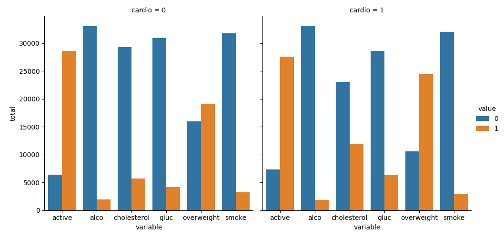
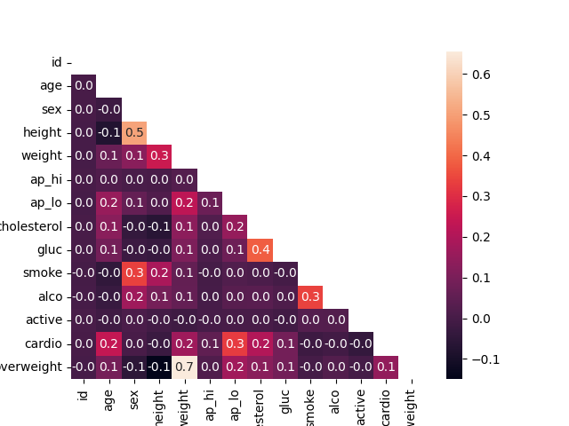

# Medical Data Visualizer

This project is a solution to the [Medical Data Visualizer challenge](https://www.freecodecamp.org/learn/data-analysis-with-python/data-analysis-with-python-projects/medical-data-visualizer) from freeCodeCamp.

## Description

This project explores a medical dataset containing various health-related features such as cholesterol levels, glucose levels, smoking habits, alcohol consumption, and physical activity. The task involves analyzing key factors that may contribute to cardiovascular diseases.

## Example Findings

Two charts have been generated and saved in the root directory:

  
This categorical plot demonstrates how people with cardiovascular diseases tend to have higher cholesterol and glucose levels, and are more likely to be overweight.

  
This correlation plot shows how certain features are more correlated than others, such as sex and height, cholesterol and glucose, and blood pressure and cardiovascular problems.
